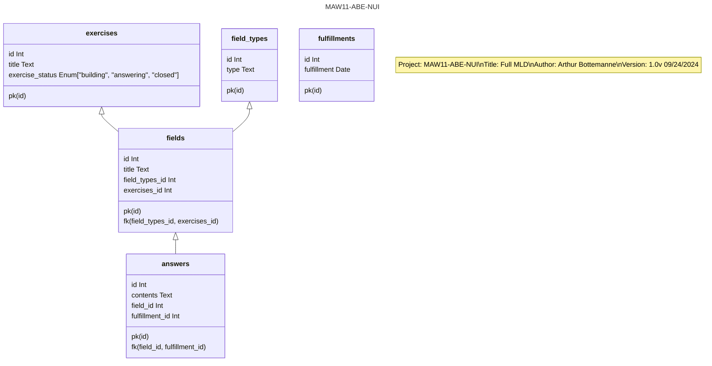

```mermaid
---
title: MAW11-ABE-NUI
---
classDiagram
    note "Project: MAW11-ABE-NUI\nTitle: Full MLD\nAuthor: Arthur Bottemanne\nVersion: 1.0v 09/24/2024"
    exercises <|-- fields
    field_types <|-- fields
    fields <|-- answers
    class exercises{
        pk(id)
        id Int
        title Text
        exercise_status Enum["building", "answering", "closed"]
    }
    class fields {
        pk(id)
        fk(field_types_id, exercises_id)
        id Int
        title Text
        field_types_id Int
        exercises_id Int
    }
    class field_types {
        pk(id)
        id Int
        type Text
    }
    class answers {
        pk(id)
        fk(field_id, fulfillment_id)
        id Int
        contents Text
        field_id Int
        fulfillment_id Int
    }
    class fulfillments {
        pk(id)
        id Int
        fulfillment Date
    }
```