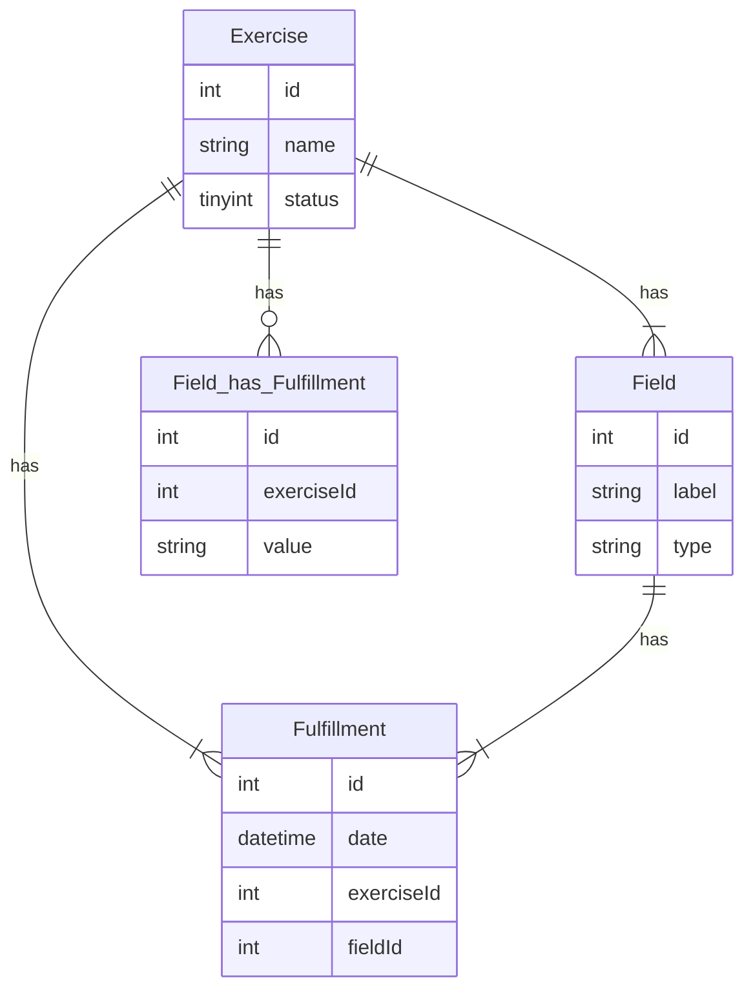

```mermaid
erDiagram
  Exercise {
    int id
    string name
    tinyint status
  }
  Field {
  int id
  string label
  string type
  }
  Fulfillment {
  int id
  datetime date
  int exerciseId
  int fieldId
  }
  Field_has_Fulfillment {
    int id
    int exerciseId
    string value
  }

  Exercise ||--o{ Field_has_Fulfillment : has
  Exercise ||--|{ Field : has
  Exercise ||--|{ Fulfillment : has
  Field ||--|{ Fulfillment : has
```